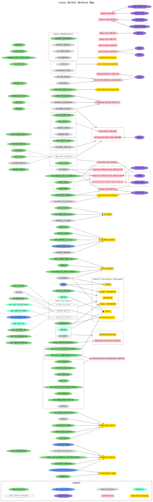

# Linux Kernel Defence Map

Linux kernel security is a very complex topic.

There are many concepts that have interesting relationships with each other:
 - Vulnerability classes
 - Exploitation techniques
 - Bug detection mechanisms
 - Defence technologies

Some defence technologies are provided by the Linux kernel mainline.
Others are going out‑of‑tree for various reasons (some of them are commercial, for example).
Moreover, there are kernel defences that depend on special hardware features.

It would be convenient to have a graphical representation of Linux kernel security.
That's why I have created a __Linux Kernel Defence Map__ showing the relationships between all these concepts.

The node connections don't mean "full mitigation." Rather, each connection represents some kind of relationship.
So the Linux Kernel Defence Map should help to navigate the documentation and Linux kernel sources.
It also provides the Common Weakness Enumeration (CWE) numbers for vulnerability classes.

This map describes kernel security hardening. It doesn't cover cutting attack surface, userspace security features
and policies enforced by various Linux Security Modules (LSM).

## Repositories

 - At GitHub <https://github.com/a13xp0p0v/linux-kernel-defence-map>
 - At Codeberg: <https://codeberg.org/a13xp0p0v/linux-kernel-defence-map> (go there if something goes wrong with GitHub)
 - At GitFlic: <https://gitflic.ru/project/a13xp0p0v/linux-kernel-defence-map>

## How this Map is made

This map is written in the DOT language, which makes maintenance and updating in Git very convenient.

License: GPL-3.0.

The diagram is generated using GraphViz with the following command:
```
dot -Tsvg linux-kernel-defence-map.dot -o linux-kernel-defence-map.svg
```

## Do you want to check your kernel configuration?

So there are plenty of security hardening options in the Linux kernel. A lot of them are
not enabled by the major distros. We have to configure these options ourselves to
make our systems more secure.

But nobody likes verifying configs manually. So I've created the [__kernel-hardening-checker__](https://github.com/a13xp0p0v/kernel-hardening-checker)
that checks security hardening options of the Linux kernel.
You are welcome to try it.

## References

- [Grsecurity features](https://grsecurity.net/features.php)

- [The State of Kernel Self Protection](https://outflux.net/slides/2021/lss/kspp.pdf) by Kees Cook

- Linux kernel [security documentation](https://www.kernel.org/doc/html/latest/security/self-protection.html)

- Linux kernel [mitigation checklist](https://github.com/hardenedlinux/grsecurity-101-tutorials/blob/master/kernel_mitigation.md) by Shawn C

- [Trends, challenge, and shifts in software vulnerability mitigation](https://github.com/Microsoft/MSRC-Security-Research/tree/master/presentations/2019_02_BlueHatIL) by MSRC

- [Pursuing Durable Safety for Systems Software](https://www.sstic.org/2020/presentation/ouverture_2020/) by Matt Miller

- [A Decade of Linux Kernel Vulnerabilities, their Mitigation and Open Problems](https://github.com/maxking/linux-vulnerabilities-10-years) by Abhilash Raj

- [Spectre & Meltdown Checker](https://github.com/speed47/spectre-meltdown-checker) by Stéphane Lesimple

## Map for Linux kernel v6.6



