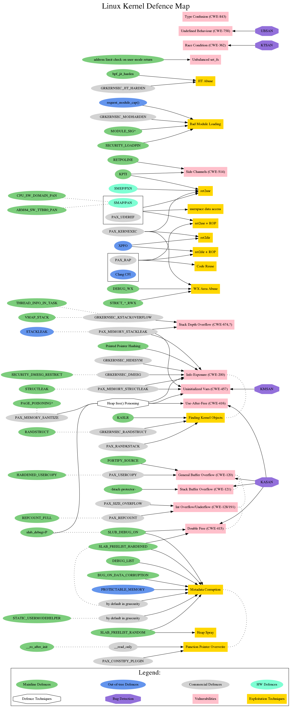

# Linux Kernel Defence Map

## Intro

Linux kernel security is a very complex topic.
Some defence technologies are provided by the Linux kernel mainline.
Others are going out‑of‑tree for various reasons (some of them are commercial, for example).
Plus there are kernel defences that depend on special hardware features.

It would certainly be convenient to have a graphical representation of the current state of Linux kernel security.

So I've created a __Linux Kernel Defence Map__ showing the relationships between:
 - Vulnerability classes
 - Exploitation techniques
 - Bug detection mechanisms
 - Defence technologies

__N.B.__ The node connections don't mean "full mitigation."
Rather, each connection represents some kind of relationship.
So this map should help to navigate the documentation and Linux kernel sources.
It also provides the Common Weakness Enumeration (CWE) numbers for vulnerability classes.

## How this Map is made

This map is written in the DOT language, which makes maintenance and updating in Git very convenient.
The diagram is generated using GraphViz with the following command:
```
dot -Tpng linux-kernel-defence-map.dot -o linux-kernel-defence-map.png
```

## Do you want to check your kernel config?

So there are plenty of Linux kernel hardening config options. A lot of them are
not enabled by the major distros. We have to enable these options ourselves to
make our systems more secure.

But nobody likes verifying configs manually. So I've created the [__kconfig-hardened-check.py__][1]
that checks security hardening options in the Linux kernel Kconfig option list.
You are welcome to try it.

## Documentation

- Grsecurity features:

  https://grsecurity.net/features.php

- The State of Kernel Self Protection by Kees Cook:

  https://outflux.net/slides/2018/lca/kspp.pdf

- Linux kernel security documentation:

  https://www.kernel.org/doc/html/latest/security/self-protection.html

- Linux kernel mitigation checklist by Shawn C:

  https://github.com/hardenedlinux/grsecurity-101-tutorials/blob/master/kernel_mitigation.md

- Trends, challenge, and shifts in software vulnerability mitigation by MSRC:

  https://github.com/Microsoft/MSRC-Security-Research/tree/master/presentations/2019_02_BlueHatIL

## The Map for v5.1



[1]: https://github.com/a13xp0p0v/kconfig-hardened-check
